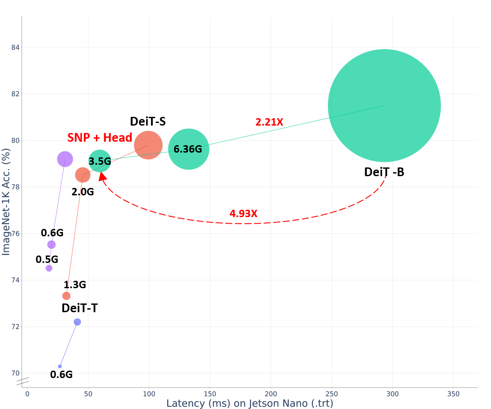
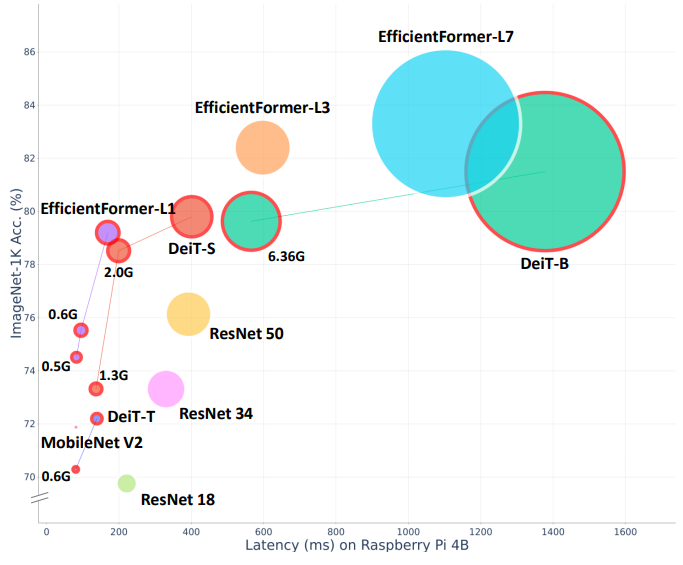
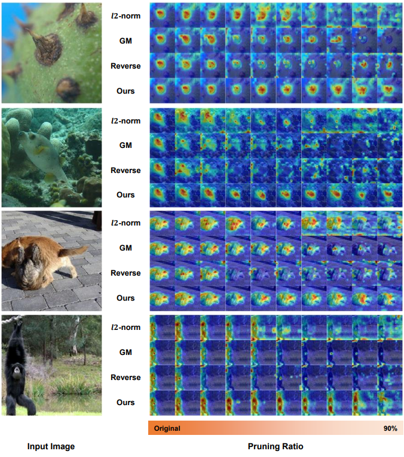

# [[ECCV 2024](https://eccv.ecva.net/)] [SNP: Structured Neuron-level Pruning to Preserve Attention Scores](https://arxiv.org/abs/2404.11630)

This repository contains the official implementation of the paper "[SNP: Structured Neuron-level Pruning to Preserve Attention Scores](https://arxiv.org/abs/2404.11630)" accepted at the [European Conference on Computer Vision (ECCV) 2024](https://eccv.ecva.net/).

## Introduction
Structured Neuron-level Pruning (SNP) prunes neurons with less informative attention scores and eliminates redundancy among heads. Our proposed method effectively compresses and accelerates Transformer-based models for both edge devices and server processors. SNP with head pruning could compress the DeiT-Base by 80\% of the parameters and computational costs and achieve 3.85× faster inference speed on RTX3090 and 4.93× on Jetson Nano.

<div align="center">
    
    
</div>

## Proposed Method

Structured Neuron-level Pruning (SNP) prunes graphically connected query and key layers having the least informative attention scores while preserving the overall attention scores. Value layers, which can be pruned independently, are pruned to eliminate inter-head redundancy.

<div align="center">
    
    
</div>

<!-- <div style="text-align: center;">
    
</div> -->

## Benchmark

<center>

| Model               | Top-1 (%)         | GFLOPs           | Raspberry Pi 4B (.onnx) | Jetson Nano (.trt)  | Xeon Silver 4210R (.pt) | RTX 3090 (.pt)        |
|---------------------|-------------------|------------------|-------------------------|----------------------|-------------------------|-----------------------|
| **DeiT-Tiny**           | 72.20             | 1.3              | 139.13                  | 41.03                | 34.74                   | 18.65                 |
| **+ SNP (Ours)**    | **70.29**         | **0.6**          | **81.63 (1.70×)**       | **26.67 (1.54×)**    | **25.25 (1.38×)**       | **17.82 (1.05×)**     |
| **DeiT-Small**          | 79.80             | 4.6              | 401.27                  | 99.32                | 53.37                   | 46.13                 |
| **+ SNP (Ours)**    | **78.52**         | **2.0**          | **199.15 (2.01×)**      | **45.51 (2.18×)**    | **38.57 (1.38×)**       | **32.91 (1.40×)**     |
| **+ SNP (Ours)**    | **73.32**         | **1.3**          | **136.68 (2.94×)**      | **32.03 (3.10×)**    | **33.46 (1.60×)**       | **26.98 (1.71×)**     |
| **DeiT-Base**           | 81.80             | 17.6             | 1377.71                 | 293.29               | 122.03                  | 151.35                |
| **+ SNP (Ours)**    | **79.63**         | **6.4**          | **565.68 (2.44×)**      | **132.55 (2.21×)**   | **64.65 (1.89×)**       | **72.96 (2.07×)**     |
| **+ SNP (Ours) + Head** | **79.12**         | **3.5**          | **307.00 (4.48×)**      | **59.47 (4.93×)**    | **46.09 (2.65×)**       | **39.31 (3.85×)**     |
| **EfficientFormer-L1**  | 79.20             | 1.3              | 169.13                  | 30.95                | 43.75                   | 26.19                 |
| **+ SNP (Ours)**    | **75.53**         | **0.6**          | **95.12 (1.78×)**       | **19.78 (1.56×)**    | **38.25 (1.14×)**       | **17.24 (1.52×)**     |
| **+ SNP (Ours)**    | **74.51**         | **0.5**          | **82.60 (2.05×)**       | **17.76 (1.74×)**    | **35.15 (1.24×)**       | **16.01 (1.64×)**     |

</center>

## Installation
```
git clone git@github.com:Nota-NetsPresso/SNP.git
pip install -r requirements.txt
```

## Getting Started
### Sign Up for  [NetsPresso](https://netspresso.ai/) 

To compress the DeiT model using SNP, you need to sign up for a NetsPresso account. You can sign up [here](https://netspresso.ai/) or go directly to the [Sign Up page](https://account.netspresso.ai/signup).

### Simple Run
To compress the DeiT-T model using SNP and train it for 20 epochs, follow these steps:
1. Run the main script:
    ```
    bash main.sh
    ```
2. When prompted, enter your NetsPresso user information:
    ```
    Please enter your NetsPresso Email:
    Please enter your NetsPresso Password:
    ```
3. Enter the path to your ImageNet dataset:
    ```
    Please enter the path to your ImageNet dataset:
    ```

### Reproduce results on ImageNet
1. To compress the DeiT model, use the following command:

    ```bash 
    python3 compress.py --NetsPresso-Email ${USER_NAME} \
                        --NetsPresso-Pwd ${USER_PWD} \
                        --model deit_tiny_patch16_224 \
                        --data-path ${IMAGENET_PATH}\
                        --output_dir ${OUPUT_DIR} \
                        --num-imgs-snp-calculation 64\
    ```
2. To train the compressed model (saved in the `compressed` directory within `output_dir`), use the following command:
    ```bash
    CUDA_VISIBLE_DEVICES=0,1,2,3,4,5,6,7\
        python3 -m torch.distributed.launch --nproc_per_node 8 --master_addr="127.0.0.1" --master_port=12345 \
            train.py --model "${OUPUT_DIR}/compressed/compressed.pt" \
                    --batch-size 256 \
                    --epochs 300 \
                    --output_dir ${OUPUT_DIR} \
                    --data-path  ${IMAGENET_PATH}\
                    > ./txt_logs/training_test.txt 2>&1 &
    ```


## Try SNP on your own Model

<div align="center">
    <a href="https://netspresso.ai/?utm_source=git&utm_medium=banner_py&utm_campaign=np_renew" target="_blank">
</div>

<br>

<div align="center">
  ☀️ NetsPresso Model Zoo ☀️ <br>
      <a href="https://github.com/Nota-NetsPresso/ModelZoo-YOLOFastest-for-ARM-U55-M85"> YOLO Fastest </a>
    | <a href="https://github.com/Nota-NetsPresso/yolox_nota"> YOLOX </a>
    | <a href="https://github.com/Nota-NetsPresso/ultralytics_nota"> YOLOv8 </a> 
    | <a href="https://github.com/Nota-NetsPresso/ModelZoo-YOLOv7"> YOLOv7 </a> 
    | <a href="https://github.com/Nota-NetsPresso/yolov5_nota"> YOLOv5 </a> 
    | <a href="https://github.com/Nota-NetsPresso/PIDNet_nota"> PIDNet </a>     
    | <a href="https://github.com/Nota-NetsPresso/pytorch-cifar-models_nota"> PyTorch-CIFAR-Models</a>
</div>
</br>

```Python
from netspresso import NetsPresso
from netspresso.enums import CompressionMethod, GroupPolicy, LayerNorm, Policy
from netspresso.clients.compressor.v2.schemas import Options

# Step 0: Login to NetsPresso
netspresso = NetsPresso(email=args.NetsPresso_Email, password=args.NetsPresso_Pwd)

# Step 1: Declare the compressor
compressor = netspresso.compressor_v2()

# Step 2: Upload the model
# Provide the path to your model and specify the input shape
model = compressor.upload_model(
    input_model_path=${MODEL_PATH},
    input_shapes=[{"batch": 1, "channel": 3, "dimension": [224, 224]}],
)

# Step 3: Select the compression method
# Specify the compression method and options
compression_info = compressor.select_compression_method(
    model_id=model.ai_model_id,
    compression_method=CompressionMethod.PR_SNP,
    options=Options(
        policy=Policy.AVERAGE,
        layer_norm=LayerNorm.TSS_NORM,
        group_policy=GroupPolicy.NONE,
        reshape_channel_axis=-1,
    ),
)

# Step 4: Load the compression ratio for each layer
# Assign the compression ratio for each available layer
for available_layer in compression_info.available_layers:
    available_layer.values = [${COMPRESS_RATIO}[available_layer.name]]

# Step 5: Compress the model
# Perform the compression and save the compressed model
compressed_model_info = compressor.compress_model(
    compression=compression_info,
    output_dir=${SAVE_DIR},
)

# Load the compressed model
compressed_model=torch.load(compressed_model_info.compressed_model_path)
```

## Citation
```bibtex
@article{shim2024snp,
  title={SNP: Structured Neuron-level Pruning to Preserve Attention Scores},
  author={Shim, Kyunghwan and Yun, Jaewoong and Choi, Shinkook},
  journal={arXiv preprint arXiv:2404.11630},
  year={2024},
  url={https://arxiv.org/abs/2404.11630}
}
```